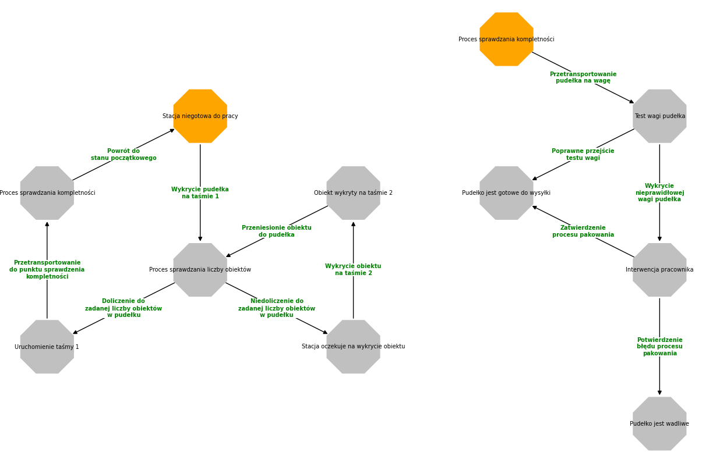

# # TS_projekt

## Temat: Proces pakowania obiektów na linii produkcyjnej

## Członkowie grupy:

* Anna Kettner
* Piotr Marciniak
* Szymon Menzel

## Schemat procesu



## Wizualizacja

[](https://www.youtube.com/watch?v=dx4ztecXt9A)


## Instalacja oprogramowania
Upewnij się, że posiadasz zainstalowany ROS Noetic. Następnie przejdź do swojego obszaru roboczego i zainstaluj odpowiednie komponenty:
```
$ cd ~/catkin_ws/src
$ sudo apt-get install ros-noetic-moveit-commander ros-noetic-gazebo-ros-pkgs ros-noetic-gazebo-ros-control ros-noetic-moveit-ros-planning-interface ros-noetic-moveit-planners-ompl ros-noetic-joint-trajectory-controller ros-noetic-tf-conversions ros-noetic-ur-client-library ros-noetic-industrial-robot-status-interface ros-noetic-position-controllers ros-noetic-robot-state-publisher ros-noetic-tf2-tools ros-noetic-moveit-simple-controller-manager
$ pip3 install transforms3d
```
Skopiuj podane repozytoria:
```
$ cd ~/catkin_ws/src
$ git clone https://github.com/K-e-t-i/TS_projekt
$ chmod +x TS_projekt/state_machine_simulation/scripts/gazebo_manager.py
```

Wróć do obszaru roboczego oraz skompiluj je:
```
$ source devel/setup.bash
$ catkin_make
```

## Uruchomienie programu

Aby uruchomić wizualizację, należy skorzystać z poniższych poleceń:

```
$ roslaunch state_machine_simulation myRobot.launch 
$ roslaunch ur3_moveit_config ur3_moveit_planning_execution.launch
$ rosrun state_machine_simulation gazebo_manager.py
```
Wizualizacja automatu oraz funkcji sprawdzającej odbywa się poprzez uruchomienie skryptu *main.py*. Należy pobrać oba pliki *main.py* oraz *nx.py*, a następnie urchomić poleceniem:

```
python3 main.py
```
